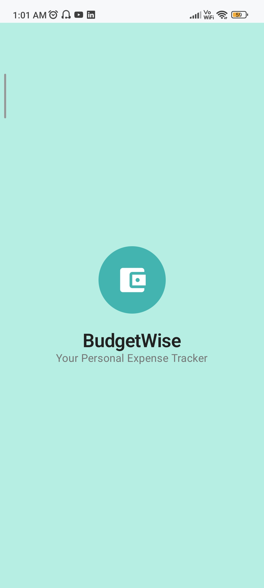
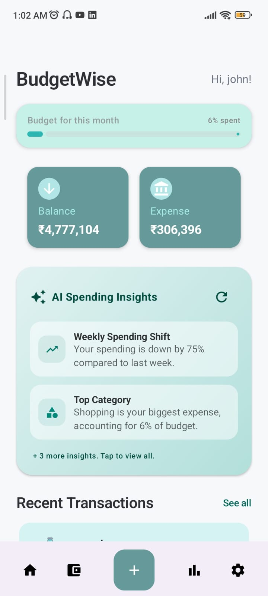
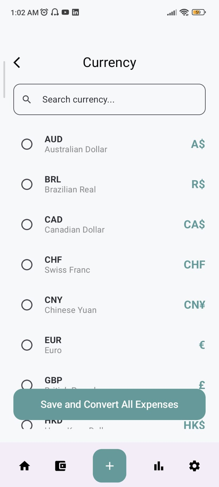

# 💰 Expense Tracker App

[](https://kotlinlang.org/)
[](https://developer.android.com/jetpack/compose)
[](https://ai.google.dev/)

This project was developed as a training outcome to apply core Android development concepts and gain practical experience in building scalable, production-grade apps.

---

## 📸 Screenshots

| Splash Screen | Home Screen | AI Insights |
| :---: | :---: | :---: |
|  |  |  |

| Category Breakdown | Expense Trend | Expense History |
| :---: | :---: | :---: |
|  |  |  |

| Add Expense | Budget Screen | Currency Settings |
| :---: | :---: | :---: |
|  |  |  |

---

## ✨ Features

🔹 **Add, Edit, Delete Transactions** – Record income & expenses with category, amount, date, and description.
🔹 **🤖 AI Insights** – Connect your Gemini API key to receive personalized financial advice based on spending patterns.
🔹 **Category Management** – Organize spending into categories (e.g., Food, Transport, Entertainment).
🔹 **Budget Planning** – Set a monthly budget and track remaining balance dynamically.
🔹 **Expense Analysis** – Visualize data using Pie Charts and Line Charts for daily, weekly, and monthly insights.
🔹 **Search & Filter** – Quickly find transactions with search functionality and category/date filters.
🔹 **Dashboard** – Get a summary view of total income, expenses, and category breakdowns.
🔹 **Modern UI** – Clean and intuitive design built entirely with Jetpack Compose.

---

## 🛠️ Tech Stack

- **Language**: Kotlin
- **UI**: Jetpack Compose, Material 3
- **Architecture**: MVVM (Model–View–ViewModel) with Clean Architecture principles
- **Local Database**: Room Persistence Library
- **Reactive Streams**: Kotlin Coroutines + Flow
- **Navigation**: Jetpack Navigation Component
- **Charts**: Custom Compose Canvas (Pie & Line Charts)
- **AI**: Google Gemini AI (Generative AI SDK)
- **Other Tools**: ViewModel, State Management, LiveData/Flow

---

## 🚀 Setup Instructions

1.  **Clone the repository**:
    ```bash
    git clone https://github.com/Moubina-naz/expense_tracker.git
    ```
2.  **Open in Android Studio**: Use the latest version of Android Studio (Koala or newer).
3.  **Get a Gemini API Key**:
    -   Visit [Google AI Studio](https://aistudio.google.com/).
    -   Generate an API key and paste it into the **Settings** screen.
4.  **Build and Run**.

---

Developed by [Moubina Naz](https://github.com/Moubina-naz) 🚀
